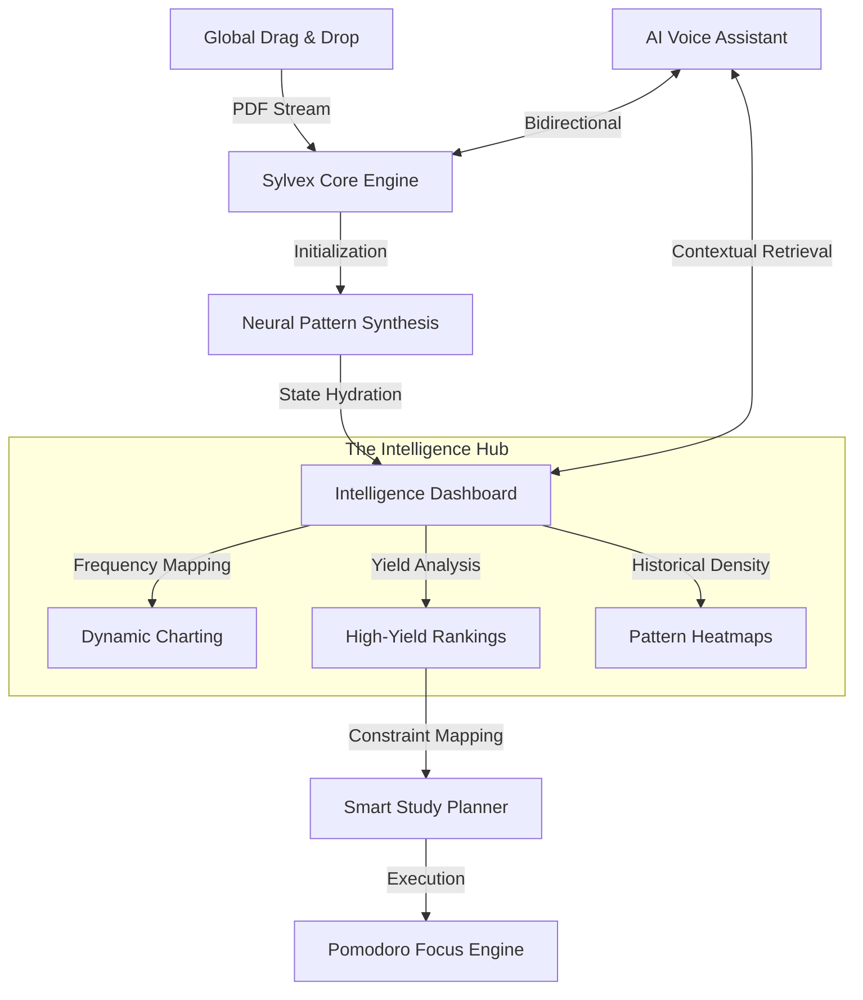

# 
🧠 Sylvex | AI-Powered Exam Intelligence

  
  
  
  

---

> **"Traditional studying is dead. Sylvex is the tactical upgrade students have been waiting for."**
> 
> Sylvex isn't just a study tool; it's a **tactical intelligence suite**. It decodes years of past paper patterns, predicts high-yield targets with neural-simulation precision, and orchestrates your study roadmap using adaptive focus engines.

---

## 🏗️ Architectural Workflow

Sylvex utilizes a **state-driven orchestration model** where every user interaction fuels a centralized intelligence hub.

---

## ✨ Innovation Highlights

### 🌌 1. Global Drag & Drop Experience
No buttons, no friction. Drag your PDFs anywhere on the cybernetic interface. A **high-contrast neural overlay** instantly captures your data, routes it through the synthesis engine, and scrolls you into your personalized insights.

### 🎙️ 2. Bi-Directional Voice Assistant
Equipped with **STT (Speech-to-Text)** and **TTS (Text-to-Speech)**. Talk to Sylvex to query your study plan, identify mastery gaps, or get instant pattern breakdowns. It’s the closest thing to having a tactical advisor by your side.

### 🧬 3. Neural Synthesis Simulation
Watch as Sylvex "thinks." During analysis, the system visualizes the extraction process with **real-time data streams**, status pulses, and keyword identification, culminating in a **Neural Link Established** achievement.

### 🕯️ 4. Focus Mode & Study Planner
Stop guessing what to study. The planner generates intensity-based roadmaps (Light/Moderate/Intense) and integrates a **Pomodoro Focus Timer** directly into each daily module to maximize retention.

---

## 🎨 Design Philosophy: Glassmorphism 2.0
Sylvex features a **premium dark-mode design system**:
- **Backdrop Blurs**: Multi-layered 24px blurs for deep focus.
- **Interactive Particle Background**: A living canvas that reacts to system state.
- **Dynamic Cursor Glow**: A soft violet light follows your navigation, illuminating the "glass" cards.
- **Fluid Animations**: Every transition is powered by custom cubic-beziers for a "heavy" yet responsive feel.

---

## 🛠️ Technical Stack

- **Frontend**: Vanilla ES6+ JavaScript, Semantic HTML5, CSS3 (Custom Grid).
- **Visualization**: **Chart.js** (Custom Minimalist Configs).
- **Intelligence**: **Web Speech API** (Recognition & Synthesis).
- **Icons**: **Lucide-JS** (SVG Vector Intelligence).
- **Animations**: CSS Variables & Canvas API (2D Particle Engine).

---

## 📂 Project Anatomy

| Component | Responsibility |
| :--- | :--- |
| `main.js` | **The Brain.** Handles state, global events, and UI orchestration. |
| `assistant.js` | **The Voice.** Manages AI chat logic and speech processing. |
| `planner.js` | **The Architect.** Handles dynamic scheduling and focus timing. |
| `style.css` | **The Skin.** Defines the Glassmorphism 2.0 design system. |

---

## 🏁 Deployment

1. **Clone** the repository.
2. **Execute** `run_local.bat` (Windows) or `run_local.sh` (Mac/Linux).
3. **Open** `http://localhost:8000` in a Chrome/Edge/Safari browser (required for Voice features).

  <b>Sylvex</b> — <i>Engineered for Academic Excellence.</i>

